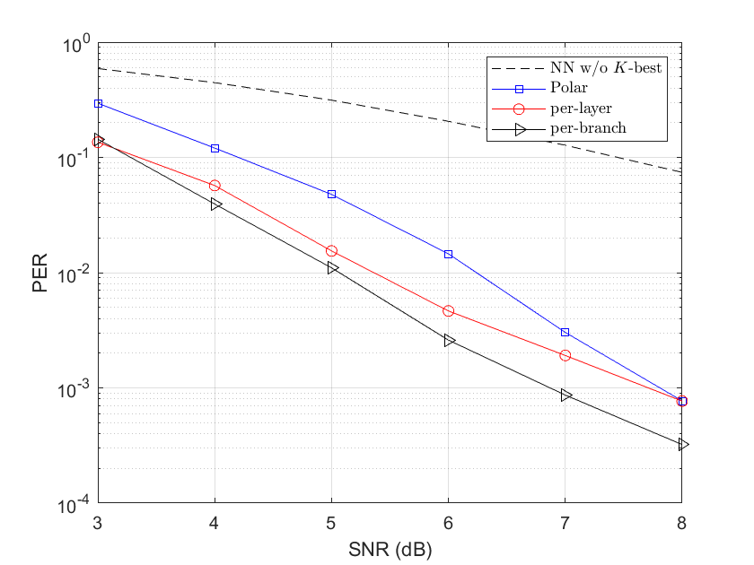

# MIMO-NOS
Source Code for My Master Thesis in Umich, submitted to possible journal publication.

## Introduction
Apply deep learning based joint coding and modulation scheme termed as **NOS** code (Near-Orthogonal Superposition code) to the multi-input multi-output (**MIMO**) system for short packet transmission. Simulation results show the proposed scheme outperforms maximum likelihood (ML) MIMO detection combined with a polar code with CRC-assisted list decoding by 1 - 2 dB in various MIMO systems for short (32 - 64 bit) message transmission. 

The flowchart of the MIMO-NOS:

## Dependency
- Python (3.6.9 or above)
- numpy
- pytorch '1.10.0+cu102'
- visdom

## Reproduce
Basicly, one can reproduce the PER results following two steps:

### Learn a good codebook

Perform end-to-end training to obtain good codebook ${\cal C}$. E.g., to transmit a 64-bit packet in a 4x4 MIMO system, 
one should set the hyperparameters in 'mimo_simu.py' as $(V=8, M=256, Nt=Nr=4)$. Then type 

    $ python3.6 mimo_simu.py

to train the neural encoder and decoder.

### Hand-crafted Looped-Kbest decoding

We design a hand-crafted looped-kbest decoder to decode the received signal. Sorting is used to determine the decoding order of the $V$ layers.
*Per-layer* sorting is faster, while the *Per-branch* sorting achieve better PER performance.

To run the looped-kbest decoder, change the hyperparameters to be consistent with that in 'mimo_simu.py', type 

    $ python3.6 looped_kbest_bs.py

for *Per-branch* sorting, while run **looped_kbest_ls.py** for *Per-layer* sorting.

## Baseline

Polar with maximum-likelihood (**ML**) MIMO detection serves as the baseline. We select Polar with CRC because of its superior performance 
in short block length. Moreover, the **optimal ML** detector is to ensure a good baseline.

Run the matlab code **mypolar.m** to obtain the PER curve.

## Performance
PER performance for 64-bit packet transmission under 4x4 MIMO.

Moreover, the proposed MIMO-NOS is able to process with faster speed compared to the baseline.

## Acknowledge
I've graduated successfully as a master student in the EECS department of the University of Michigan. Many thanks to my supervisor Hunseok and the group members, Mingyu, Chinwei and Changwoo in the lab!
